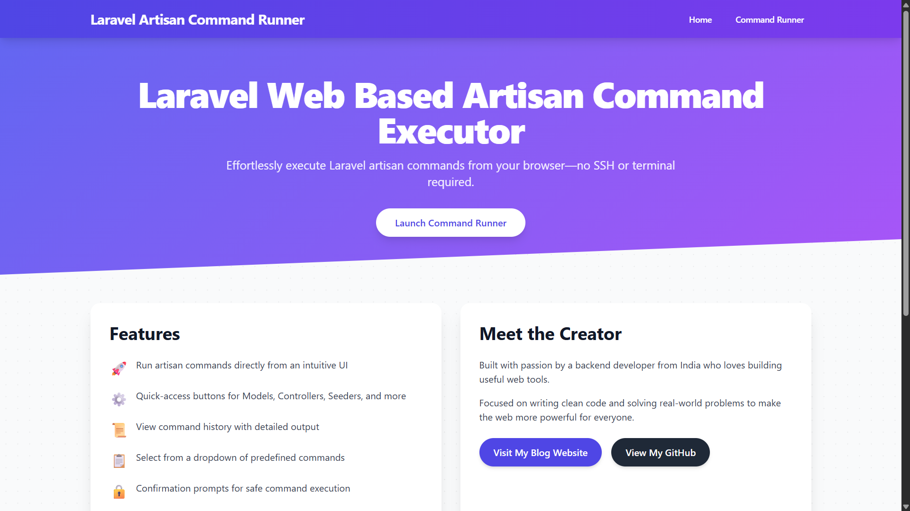

# Laravel Web Based Artisan Command Executor

  
  


A web-based tool to execute Laravel Artisan commands directly from your browser, eliminating the need for SSH or terminal access. Built with Laravel 12, Tailwind CSS (via CDN), and jQuery, this project offers a user-friendly interface for developers to streamline their workflow.

## 🚀 Features

- **Run Artisan Commands**: Execute any Laravel Artisan command via a simple web interface.
- **Common Commands Dropdown**: Quickly select from a list of frequently used commands.
- **Instant Action Buttons**: One-click buttons for generating models, controllers, middleware, seeders, and factories.
- **Command History**: View a detailed log of executed commands with their outputs.
- **Confirmation Prompts**: Safe command execution with SweetAlert2 confirmation dialogs.
- **Responsive Design**: Built with Tailwind CSS for a modern, responsive UI.
- **AJAX-Powered**: Seamlessly run commands and update the UI without page reloads.

## 📸 Screenshot

### Command Runner
  
*Run Artisan commands directly from your browser with a clean and intuitive interface.*

### Homepage
  
*Welcome to the Laravel Web Artisan Panel with an overview of features and quick access to the Command Runner.*

## 📋 Prerequisites

- **PHP**: `^8.2`
- **Laravel**: `^12.0`
- **Composer**: Latest version
- A web server (e.g., Apache/Nginx) with MySQL for the database

## 🛠️ Installation

1. **Clone the Repository**:
   ```bash
   git clone https://github.com/vickypandey14/laravel-web-based-artisan-command-executor.git
   cd laravel-web-based-artisan-command-executor
   ```

2. **Install Dependencies**:
   ```bash
   composer install
   ```

3. **Set Up Environment**:
   - Copy the `.env.example` file to `.env`:
     ```bash
     cp .env.example .env
     ```
   - Generate an application key:
     ```bash
     php artisan key:generate
     ```

4. **Configure Database**:
   - Update your `.env` file with your MySQL database credentials:
     ```
     DB_CONNECTIONmysql
     DB_HOST=127.0.0.1
     DB_PORT=3306
     DB_DATABASE=command_executor
     DB_USERNAME=root
     DB_PASSWORD=
     ```
   - Ensure your MySQL server is running and the database `command_executor` exists (or update the `DB_DATABASE` value to match your database name).

5. **Run Migrations**:
   ```bash
   php artisan migrate
   ```

6. **Serve the Application**:
   - Start the Laravel development server:
     ```bash
     php artisan serve
     ```

7. **Access the Application**:
   - Open your browser and navigate to `http://localhost:8000`.

## 📖 Usage

1. **Navigate to the Command Runner**:
   - From the homepage, click on the "Command Runner" link in the navigation bar.

2. **Run a Command**:
   - Enter an Artisan command (e.g., `make:model Post -mcr`) in the input field and click "Run Command".
   - Alternatively, select a command from the "Common Commands" dropdown or use the instant action buttons (e.g., "Model + Migration + Controller").

3. **View Output**:
   - The command output will be displayed in the "Command Output" section.
   - The command and its output will also be logged in the "Command History" section.

4. **Clear History**:
   - Click the "Clear History" button to remove all logged commands.

## ⚠️ Security Note

This tool allows execution of arbitrary Artisan commands via a web interface, which can be dangerous in a production environment. It is recommended to:
- Restrict access using Laravel authentication middleware (e.g., `auth`).
- Whitelist allowed commands to prevent destructive actions (e.g., `db:wipe`).
- Use this tool in a development environment only.

## 🛠️ Development Scripts

The following scripts are available in `composer.json`:

- **Start Development Environment**:
  ```bash
  composer dev
  ```
  This runs the Laravel server, queue listener, and logs tailing concurrently.

- **Run Tests**:
  ```bash
  composer test
  ```

## 🤝 Contributing

Contributions are welcome! To contribute:

1. Fork the repository.
2. Create a new branch (`git checkout -b feature/your-feature`).
3. Make your changes and commit them (`git commit -m "Add your feature"`).
4. Push to your branch (`git push origin feature/your-feature`).
5. Open a Pull Request.

Please ensure your code follows Laravel's coding standards (use `composer pint` to format code) and includes tests where applicable.

## 📜 License

This project is open-sourced under the [MIT License](LICENSE).

## 👨‍💻 Author

**Vivek Chandra Pandey (Vicky)**  
- GitHub: [vickypandey14](https://github.com/vickypandey14)

---

⭐ If you find this project helpful, please give it a star on [GitHub](https://github.com/vickypandey14/laravel-web-based-artisan-command-executor)!